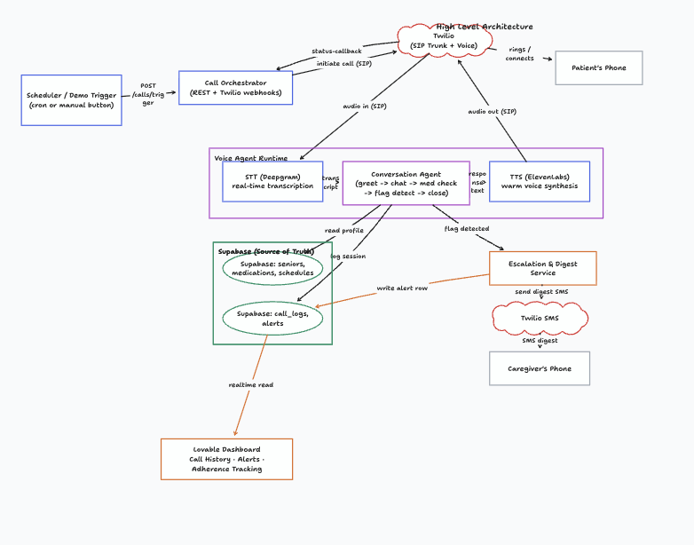

# Grandma's Pill Buddy

AI-powered voice agent that calls elderly patients daily to check medication adherence and wellbeing. Built for the ABI Hackathon.

## How it works

1. The **backend** triggers an outbound Twilio call to a senior's phone number
2. The **voice agent** greets the patient, checks if they took their meds, and asks how they're doing — powered by Claude (Anthropic) for conversation and ElevenLabs for warm voice synthesis
3. If a dose was missed, an SMS alert is sent to the caregiver via Twilio
4. After every call, the **judge agent** evaluates the conversation quality and feeds learnings back into the next call's system prompt — making the agent self-improving

## Architecture



```
Twilio ──► voice-agent (FastAPI :8000)
               │  Claude (claude-sonnet-4-6)
               │  ElevenLabs TTS (Sarah voice)
               │
               ├──► backend (FastAPI :8080)
               │        Supabase (patient data, call logs, alerts)
               │        Twilio SMS (caregiver alerts)
               │
               └──► judge-agent (FastAPI :8001)
                        Claude evaluates transcript quality
                        Learnings injected into next call
```

## Services

| Service | Port | Description |
|---|---|---|
| `voice-agent` | 8000 | Twilio webhook handler + Claude conversation engine |
| `backend` | 8080 | Call scheduler, Supabase persistence, caregiver alerts |
| `judge-agent` | 8001 | Self-improvement loop — evaluates calls, extracts lessons |

## Running locally with Docker

### Prerequisites
- Docker
- ngrok (for Twilio webhooks): `ngrok config add-authtoken <token>`
- Twilio account with a voice-capable number
- Supabase project with the schema from `db/`
- Anthropic API key
- ElevenLabs API key

### 1. Configure environment

Copy and fill in the env files:

```bash
cp backend/.env.example backend/.env
cp voice-agent/.env.example voice-agent/.env
cp judge-agent/.env.example judge-agent/.env
```

**`voice-agent/.env`**
```
ANTHROPIC_API_KEY=...
ELEVENLABS_API_KEY=...
BASE_URL=https://<your-ngrok-url>      # ngrok tunnel for voice-agent
SUPABASE_URL=https://<project>.supabase.co
SUPABASE_ANON_KEY=...
# BACKEND_URL and JUDGE_URL are set automatically by docker-compose
```

**`backend/.env`**
```
SUPABASE_URL=https://<project>.supabase.co
SUPABASE_SERVICE_ROLE_KEY=...
TWILIO_ACCOUNT_SID=...
TWILIO_AUTH_TOKEN=...
TWILIO_FROM_NUMBER=+1...
PUBLIC_BASE_URL=https://<your-ngrok-url>           # ngrok tunnel for backend
VOICE_AGENT_TWIML_URL=https://<voice-agent-ngrok-url>/voice/incoming
```

**`judge-agent/.env`**
```
ANTHROPIC_API_KEY=...
```

### 2. Start ngrok

Two tunnels — one for each public-facing service:

```bash
ngrok http 8000   # voice-agent — copy URL into voice-agent/.env BASE_URL
ngrok http 8080   # backend    — copy URL into backend/.env PUBLIC_BASE_URL
```

### 3. Build and start everything

```bash
docker compose up --build -d
```

All three services start together. Inter-service communication is handled automatically over Docker's internal network.

### 4. Useful commands

```bash
docker compose logs -f                  # stream all logs
docker compose logs -f voice-agent      # logs for one service
docker compose up --build -d voice-agent  # rebuild + restart one service
docker compose down                     # stop everything
```

### 5. Configure Twilio

In your Twilio console, set the voice webhook for your number to:
```
https://<voice-agent-ngrok-url>/voice/incoming
```

### 6. Trigger a demo call

```bash
# Call a specific senior by ID
curl -X POST http://localhost:8080/calls/trigger \
  -H "Content-Type: application/json" \
  -d '{"senior_id": "a0000000-0000-0000-0000-000000000001"}'

# Or call any phone number directly
curl -X POST http://localhost:8080/calls/invoke \
  -H "Content-Type: application/json" \
  -d '{"phone": "+19176559764", "name": "Rose"}'
```

## Tech stack

- **Conversation**: Anthropic Claude (`claude-sonnet-4-6`)
- **Voice synthesis**: ElevenLabs (Sarah — premade voice, free tier compatible)
- **Telephony**: Twilio Voice + SMS
- **Database**: Supabase (PostgreSQL)
- **Backend**: Python FastAPI
- **Self-improvement**: LLM-as-judge pattern — call transcripts evaluated after each conversation, lessons injected into next call's system prompt
